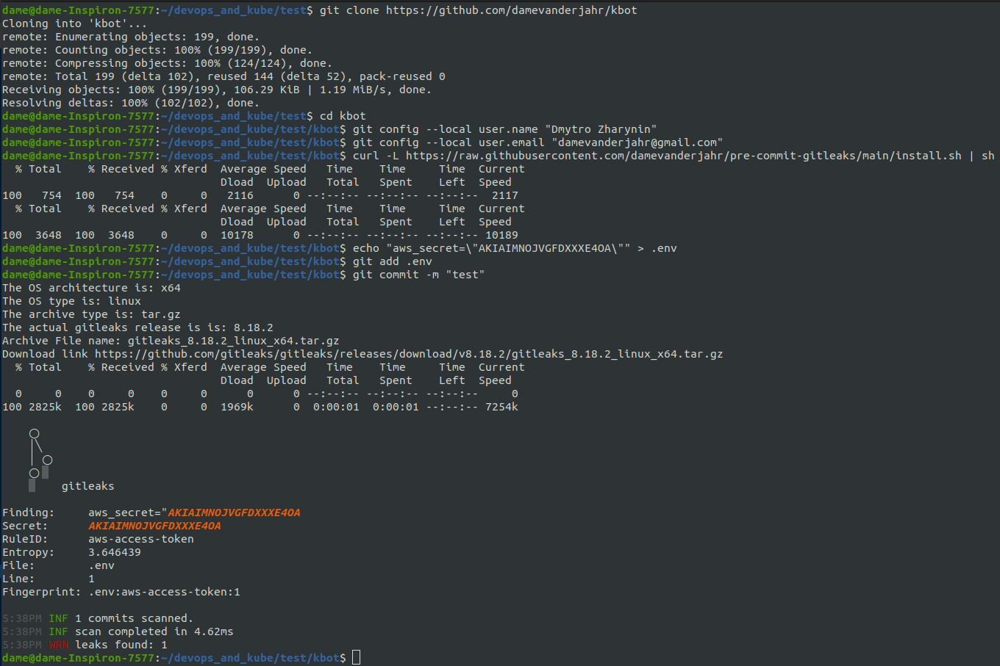
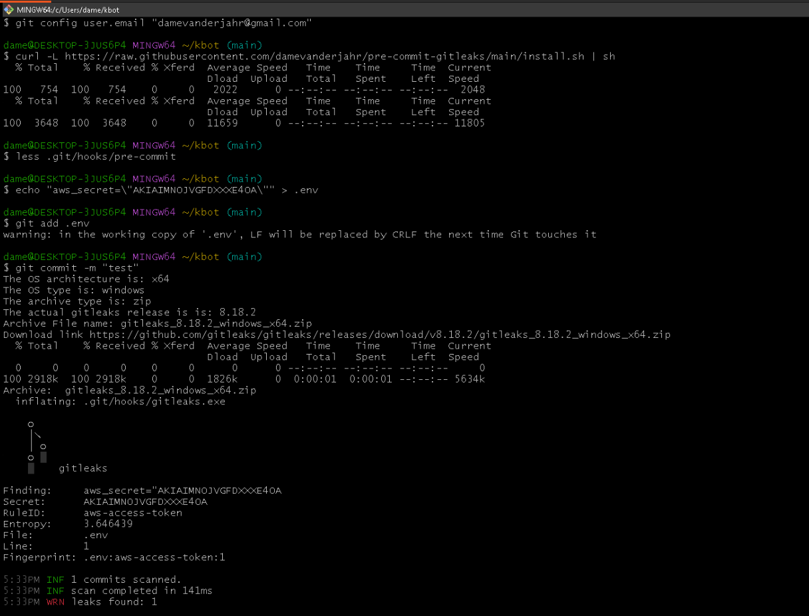

# pre-commit-gitleaks

## Disclaimer

This is proof-of-concept scripts for gitleaks pre-commit hook install. It's better not to use it.

Use officially approved way: [.pre-commit-config.yaml](https://github.com/gitleaks/gitleaks?tab=readme-ov-file#pre-commit) + [pre-commit tool](https://pre-commit.com/#install)

## Installation and updates

Run in your target clonned repo directory:

```sh
curl -L https://raw.githubusercontent.com/damevanderjahr/pre-commit-gitleaks/main/install.sh | sh
```

This command install pre-commit hook, or updates the existing one

gitleaks binary is downloaded during the first check, and could be updated with

```bash
.git/hooks/pre-commit --update
```

if gitleaks is the only pre-commit hook

or

```bash
.git/hooks/pre-commit-gitleaks --update
```

if there was other pre-commit hook script before the installation.

## OS support

Should be supported on Linux, Windows, MacOS supported by [gitleaks v8.18.2](https://github.com/gitleaks/gitleaks/releases/tag/v8.18.2)

Tested on Ubuntu 22.04 x64, Windows 10 with [basic Git (Git bash) installation](https://git-scm.com/download/win)

Ubuntu:


Windows:


## Disable check

Check could be disabled with

```sh
git config --local --add hooks.pre-commit.enable false
```
